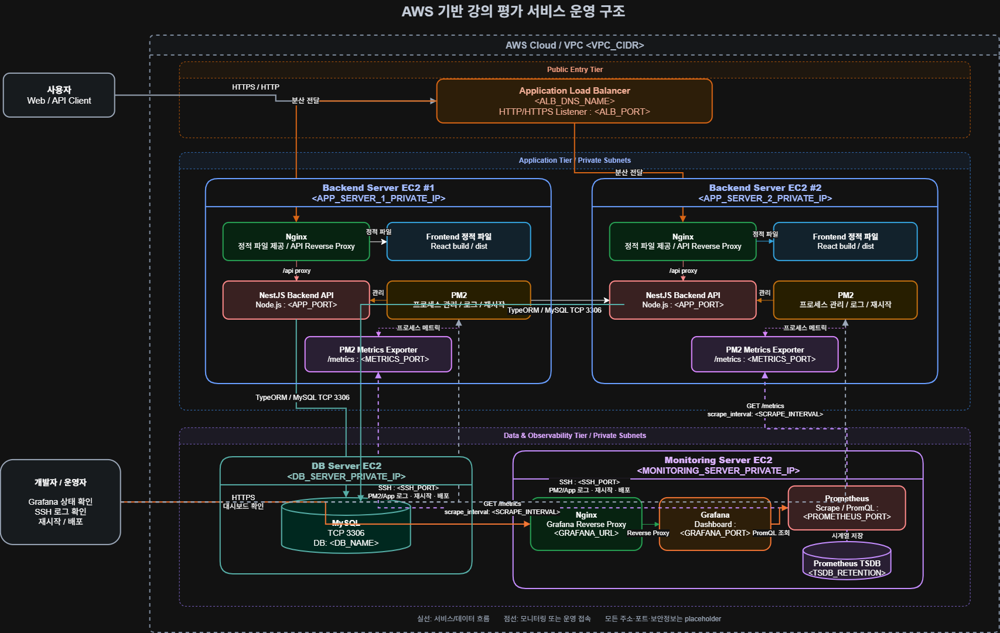
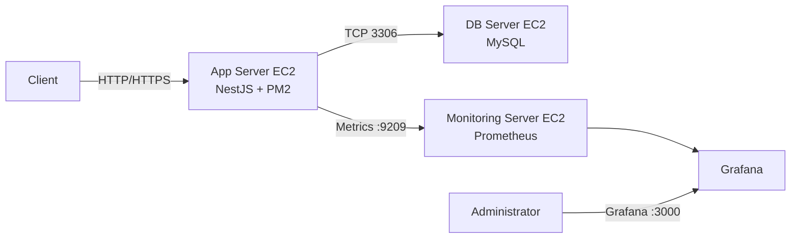

# 강의 평가 시스템

React + NestJS + TypeORM + MySQL + JWT 기반의 강의용 웹 애플리케이션입니다.

## 프로젝트 구조

```
2026_study_lecture/
├── backend/     # NestJS API 서버
└── frontend/    # React (Vite) 클라이언트
```

## 포트 및 접속 구조

| 구분 | 포트 | 바인딩 | 접속 예시 |
|------|------|--------|-----------|
| 백엔드 API | 3000 | `0.0.0.0` | `http://<서버IP>:3000` |
| 프론트 Web | 5173 | `0.0.0.0` | `http://<서버IP>:5173` |
| MySQL | 3306 | 로컬 | EC2 내부에서만 접속 |

프론트는 `/api` 경로로 백엔드를 호출합니다.
- **개발:** Vite proxy가 `/api` → `localhost:3000` 으로 전달
- **운영(EC2):** nginx가 `/api` → `127.0.0.1:3000` 으로 전달

## 사전 준비

1. Node.js 20+
2. MySQL 8.0 (포트 3306, 로컬 설치)
3. MySQL 데이터베이스 생성

```sql
CREATE DATABASE lecture_eval CHARACTER SET utf8mb4 COLLATE utf8mb4_unicode_ci;
```

## 실행 방법

### 한 번에 실행 (루트 폴더)

```bash
npm install        # 최초 1회 (concurrently 설치)
npm run dev        # 백엔드 + 프론트 동시 실행
```

개별 실행:
```bash
npm run dev:backend   # API: 0.0.0.0:3000
npm run dev:frontend  # Web: 0.0.0.0:5173
```

외부(같은 네트워크/EC2)에서 접속:
```
http://<서버IP>:5173    # 프론트
http://<서버IP>:3000    # API 직접 호출
```

EC2 보안 그룹에서 **5173, 3000** 포트 인바운드를 열어야 합니다.
운영 배포 시에는 **80(nginx)** 만 열고 3000/5173은 닫는 것을 권장합니다.

> **주의:** 반드시 **프로젝트 루트**(`2026_study_lecture/`)에서 실행하세요.  
> `backend/`나 `frontend/` 폴더 안에서 `npm run dev`를 치면 스크립트가 없거나 동작이 다릅니다.

### 사전 설정 (필수)

1. MySQL에서 DB 생성
2. `backend/.env`에서 `DB_PASSWORD` 수정
3. EC2 외부 접속 시 `CORS_ORIGINS`에 프론트 주소 추가

```bash
# backend/.env 예시 (EC2)
HOST=0.0.0.0
PORT=3000
CORS_ORIGINS=http://localhost:5173,http://13.125.x.x:5173
```

### 실행이 안 될 때

| 증상 | 원인 | 해결 |
|------|------|------|
| `Could not read package.json` | 루트가 아닌 폴더에서 실행 | `2026_study_lecture/`에서 실행 |
| `Missing script: "dev"` | backend 폴더에서 실행 | 루트에서 `npm run dev` 또는 `npm run dev:backend` |
| 백엔드가 계속 Retrying... | MySQL 비밀번호/DB 미설정 | `.env`의 `DB_PASSWORD`, DB 생성 확인 |
| Vite `bundling dependencies...` | 첫 실행 시 의존성 번들링 | 1~2분 기다리면 http://localhost:5173 접속 가능 |

### 1. 백엔드

```bash
cd backend
copy .env.example .env   # Windows
# .env 파일에서 DB 비밀번호 등 수정

npm run start:dev
```

- API: http://localhost:3000
- TypeORM `synchronize: true`로 테이블 자동 생성 (강의용)

### 2. 프론트엔드

```bash
cd frontend
copy .env.example .env

npm run dev
```

- Web: http://localhost:5173 (또는 http://<서버IP>:5173)

## AWS EC2 배포 (운영)

### 1. EC2 보안 그룹
| 포트 | 용도 |
|------|------|
| 22 | SSH |
| 80 | nginx (운영 권장) |
| 5173, 3000 | 개발/테스트 시에만 개방 |

### 2. 서버 설정
```bash
# 프로젝트 클론 후
npm install
cd backend && npm install && cd ..
cd frontend && npm install && cd ..

# backend/.env 설정 (DB, HOST, CORS_ORIGINS)
# frontend 빌드 (nginx /api 프록시 사용)
cd frontend
echo VITE_API_URL=/api > .env.production
npm run build
```

### 3. nginx (예시: deploy/nginx.conf.example)
```bash
sudo cp deploy/nginx.conf.example /etc/nginx/conf.d/lecture-eval.conf
# root 경로를 실제 dist 위치로 수정
sudo nginx -t && sudo systemctl reload nginx
```

### 4. 백엔드 실행 (PM2 등)
```bash
npm run build
npm run start:prod   # 0.0.0.0:3000 에서 API 실행
```

접속: `http://<EC2-공인IP>/` (nginx 80 → 프론트, `/api` → 백엔드)

## SFTP 배포 (zip)

로컬에서 배포용 zip 생성:

```bash
npm install
npm run build:zip
```

| 명령어 | 결과 |
|--------|------|
| `npm run build:zip` | `deploy/backend-deploy.zip` + `deploy/frontend-deploy.zip` |
| `npm run build:zip:backend` | 백엔드만 |
| `npm run build:zip:frontend` | 프론트만 |

상세 절차: [deploy/SFTP-DEPLOY.md](deploy/SFTP-DEPLOY.md)  
(DB EC2 분리 방법도 동 문서에 정리)

## 기본 관리자 계정

`.env`의 `ADMIN_EMAIL`, `ADMIN_PASSWORD`로 최초 1회 자동 생성됩니다.

기본값:
- email: admin@example.com
- password: admin1234

## 주요 기능

| 기능 | 설명 |
|------|------|
| 회원가입/로그인 | JWT Bearer 토큰 인증 |
| 게시판 | 글 CRUD + 댓글 |
| 마이페이지 | 프로필 수정, 내 글 목록 |
| 관리자 | 대시보드, 회원/게시글 관리 |

## API 요약

| Method | Path | 설명 | 인증 |
|--------|------|------|------|
| POST | /auth/register | 회원가입 | X |
| POST | /auth/login | 로그인 | X |
| GET | /users/me | 내 정보 | O |
| PATCH | /users/me | 프로필 수정 | O |
| GET | /users/me/posts | 내 글 목록 | O |
| GET | /posts | 게시글 목록 | X |
| GET | /posts/:id | 게시글 상세 | X |
| POST | /posts | 글 작성 | O |
| PATCH | /posts/:id | 글 수정 | O |
| DELETE | /posts/:id | 글 삭제 | O |
| POST | /posts/:postId/comments | 댓글 작성 | O |
| DELETE | /comments/:id | 댓글 삭제 | O |
| GET | /admin/dashboard | 통계 | Admin |
| GET | /admin/users | 회원 목록 | Admin |
| PATCH | /admin/users/:id/role | 권한 변경 | Admin |
| DELETE | /admin/users/:id | 회원 삭제 | Admin |
| GET | /admin/posts | 게시글 목록 | Admin |


---------------------------------------------------------------

# 강의 평가 API

Node.js와 NestJS로 개발한 강의 평가 백엔드 API입니다. 애플리케이션, 데이터베이스, 모니터링 서버를 각각 별도의 EC2 인스턴스로 구성하며, PM2로 애플리케이션 프로세스를 관리합니다.

## 주요 기술

- Node.js
- NestJS
- TypeORM
- MySQL
- JWT
- PM2
- pm2-metrics
- Prometheus
- Grafana
- AWS EC2

## 아키텍처

### AWS 서비스 운영 구조도



위 구조도는 사용자 요청이 Application Load Balancer를 통해 두 대의 Backend Server EC2로 분산되는 흐름과 MySQL, Prometheus, Grafana 및 운영자의 SSH 관리 경로를 보여줍니다.

### 간략 구성



### 서버 구성

| 서버 | 역할 | 주요 포트 |
|---|---|---:|
| App Server EC2 | NestJS API 및 PM2 실행 | `<APP_PORT>` |
| DB Server EC2 | MySQL 데이터 저장 | `3306` |
| Monitoring Server EC2 | Prometheus 및 Grafana 실행 | `9090`, `3000` |
| pm2-metrics | PM2 애플리케이션 메트릭 제공 | `<PM2_METRICS_PORT>` |

권장 예시:

```text
APP_PORT=3000
PM2_METRICS_PORT=9209
PROMETHEUS_PORT=9090
GRAFANA_PORT=3000
```

## 환경변수 설정

백엔드 디렉터리에 `.env` 파일을 생성합니다.

```env
NODE_ENV=production
HOST=0.0.0.0
PORT=<APP_PORT>

DB_HOST=<DB_SERVER_PRIVATE_IP>
DB_PORT=3306
DB_USERNAME=<DB_USERNAME>
DB_PASSWORD=<DB_PASSWORD>
DB_DATABASE=<DB_NAME>

JWT_SECRET=<JWT_SECRET>
JWT_EXPIRES_IN=1h

CORS_ORIGINS=<ALLOWED_ORIGIN>
```

실제 `.env`, PEM 키, 비밀번호는 Git에 커밋하지 않습니다.

```gitignore
.env
.env.*
!.env.example

*.pem
*.key

node_modules/
dist/
coverage/
```

## 백엔드 실행

### 1. 의존성 설치

```bash
npm ci
```

### 2. 프로덕션 빌드

```bash
npm run build
```

### 3. PM2 실행

PM2 설정 파일을 사용하는 경우:

```bash
pm2 start launch-backend.config.js
```

이미 실행 중인 애플리케이션을 갱신하는 경우:

```bash
pm2 startOrReload launch-backend.config.js --update-env
```

상태 확인:

```bash
pm2 list
pm2 describe <PM2_APP_NAME>
```

로그 확인:

```bash
pm2 logs <PM2_APP_NAME>
```

서버 재부팅 이후에도 자동으로 실행되도록 설정합니다.

```bash
pm2 save
pm2 startup
```

`pm2 startup`이 출력하는 추가 명령도 실행해야 합니다.

## API 동작 확인

App Server 내부에서 확인:

```bash
curl http://127.0.0.1:<APP_PORT>/health
```

다른 서버에서 Private IP로 확인:

```bash
curl http://<APP_SERVER_PRIVATE_IP>:<APP_PORT>/health
```

예상 응답:

```json
{
  "status": "ok"
}
```

## 모니터링 구성

모니터링 흐름은 다음과 같습니다.

```text
NestJS/PM2
  → pm2-metrics
  → Prometheus scrape
  → Grafana 시각화
```

### 1. pm2-metrics 확인

App Server에서 메트릭 엔드포인트를 확인합니다.

```bash
sudo ss -lntp | grep ':<PM2_METRICS_PORT>'
curl http://127.0.0.1:<PM2_METRICS_PORT>/metrics
```

다른 서버에서 접근하려면 메트릭 서비스가 다음 주소에서 수신해야 합니다.

```text
0.0.0.0:<PM2_METRICS_PORT>
```

`127.0.0.1:<PM2_METRICS_PORT>`에만 바인딩되어 있으면 Monitoring Server에서 접근할 수 없습니다.

### 2. Prometheus 설정

Monitoring Server의 `prometheus.yml`에 App Server를 등록합니다.

```yaml
scrape_configs:
  - job_name: "lecture-eval-backend"
    scrape_interval: 15s
    static_configs:
      - targets:
          - "<APP_SERVER_PRIVATE_IP>:<PM2_METRICS_PORT>"
```

설정 검사 후 Prometheus를 재시작합니다.

```bash
promtool check config /etc/prometheus/prometheus.yml
sudo systemctl restart prometheus
sudo systemctl status prometheus --no-pager
```

Monitoring Server에서 직접 메트릭 연결을 확인합니다.

```bash
curl http://<APP_SERVER_PRIVATE_IP>:<PM2_METRICS_PORT>/metrics
```

Prometheus Targets 페이지:

```text
http://<MONITORING_SERVER_PRIVATE_IP>:9090/targets
```

대상 상태가 `UP`이면 정상입니다.

### 3. Grafana 확인

Grafana 상태를 확인합니다.

```bash
sudo systemctl status grafana-server --no-pager
sudo ss -lntp | grep ':3000'
curl -I http://127.0.0.1:3000/login
```

Grafana 접속 주소:

```text
http://<MONITORING_SERVER_PUBLIC_IP>:3000
```

Grafana에서 Prometheus 데이터 소스를 추가합니다.

```text
Name: Prometheus
URL: http://127.0.0.1:9090
```

Prometheus와 Grafana가 서로 다른 서버라면:

```text
URL: http://<PROMETHEUS_PRIVATE_IP>:9090
```

## 보안 그룹 권장 설정

### App Server

| 포트 | 소스 | 용도 |
|---:|---|---|
| `<APP_PORT>` | ALB 보안 그룹 또는 허용된 클라이언트 | API |
| `<PM2_METRICS_PORT>` | Monitoring Server 보안 그룹 | Prometheus scrape |
| `22` | 관리 서버 또는 허용된 관리자 IP | SSH |

### DB Server

| 포트 | 소스 | 용도 |
|---:|---|---|
| `3306` | App Server 보안 그룹 | MySQL |
| `22` | 관리 서버 또는 허용된 관리자 IP | SSH |

### Monitoring Server

| 포트 | 소스 | 용도 |
|---:|---|---|
| `3000` | 허용된 관리자 공인 IP 또는 ALB SG | Grafana |
| `9090` | 내부망 또는 허용된 관리자 IP | Prometheus |
| `22` | 허용된 관리자 IP | SSH |

DB 및 메트릭 포트를 `0.0.0.0/0`에 공개하지 않는 것을 권장합니다. 가능하면 Private IP 대신 보안 그룹 ID를 소스로 지정합니다.

## 트러블슈팅

### `Could not resolve host`

```text
curl: (6) Could not resolve host: APP_SERVER_PRIVATE_IP
```

placeholder를 실제 값으로 바꾸지 않은 경우입니다.

잘못된 명령:

```bash
curl http://APP_SERVER_PRIVATE_IP:<PORT>
```

올바른 명령:

```bash
curl http://<실제_PRIVATE_IP>:<PORT>
```

또는:

```bash
APP_SERVER_PRIVATE_IP="<실제_PRIVATE_IP>"
curl "http://${APP_SERVER_PRIVATE_IP}:<PORT>"
```

### `Connection timed out`

주요 원인:

- 대상 서버 보안 그룹에 포트가 열려 있지 않음
- 잘못된 Private IP 사용
- 서로 다른 VPC 사이에 라우팅이 없음
- Network ACL 차단
- Monitoring Server의 아웃바운드 제한

연결 테스트:

```bash
nc -vz -w 5 <APP_SERVER_PRIVATE_IP> <PM2_METRICS_PORT>
```

### `Connection refused`

대상 포트에 실행 중인 프로세스가 없는 경우입니다.

```bash
sudo ss -lntp | grep ':<PORT>'
sudo lsof -nP -iTCP:<PORT> -sTCP:LISTEN
```

### 로컬에서는 되지만 원격에서 안 됨

서비스가 `127.0.0.1`에만 바인딩됐는지 확인합니다.

```bash
sudo ss -lntp | grep ':<PORT>'
```

원격 연결을 허용하려면 다음처럼 수신해야 합니다.

```text
0.0.0.0:<PORT>
```

### Prometheus Target이 `DOWN`

Monitoring Server에서 직접 확인합니다.

```bash
curl -v http://<APP_SERVER_PRIVATE_IP>:<PM2_METRICS_PORT>/metrics
```

Prometheus 로그:

```bash
sudo journalctl -u prometheus -n 100 --no-pager
```

설정 검사:

```bash
promtool check config /etc/prometheus/prometheus.yml
```

### Grafana에 데이터가 표시되지 않음

다음 항목을 순서대로 확인합니다.

1. Grafana 데이터 소스의 Prometheus URL
2. Prometheus Targets의 `UP/DOWN` 상태
3. Prometheus에서 메트릭 직접 조회
4. Grafana 대시보드의 `job` 라벨
5. 조회 시간 범위

Prometheus에서 Target 상태 확인:

```promql
up{job="lecture-eval-backend"}
```

정상 값:

```text
1
```

### PM2 애플리케이션이 실행되지 않음

```bash
pm2 list
pm2 logs <PM2_APP_NAME> --lines 100
```

환경변수를 변경했다면:

```bash
pm2 restart <PM2_APP_NAME> --update-env
```

## 보안 주의사항

- 실제 IP, DB 비밀번호, JWT Secret, PEM 키 이름을 문서에 기록하지 않습니다.
- `.env`와 키 파일을 Git에 커밋하지 않습니다.
- DB와 메트릭 포트는 Private Network에서만 접근하도록 제한합니다.
- Grafana를 인터넷에 공개할 경우 HTTPS, 강력한 비밀번호 및 접근 IP 제한을 적용합니다.
- 운영 환경에서는 기본 Grafana 관리자 비밀번호를 반드시 변경합니다.
| DELETE | /admin/posts/:id | 게시글 삭제 | Admin |
| GET | /health | 서버 상태 | X |
| GET | /db-check | DB 연결 확인 | X |
| GET | /server-info | 서버 정보 | X |
